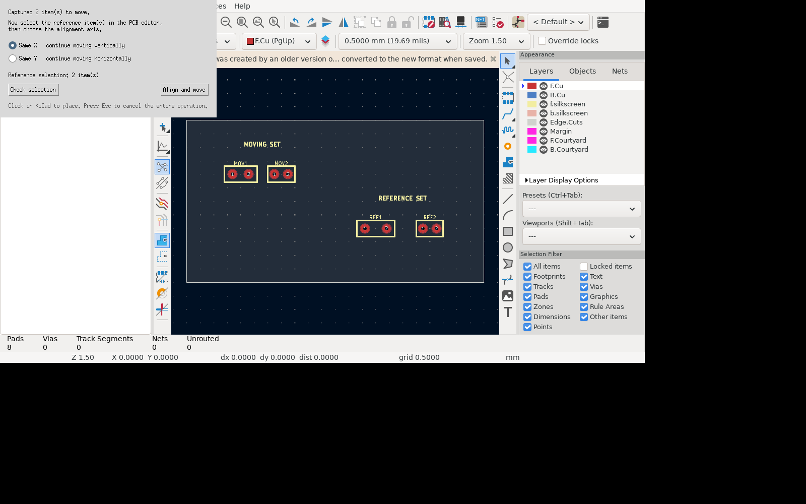
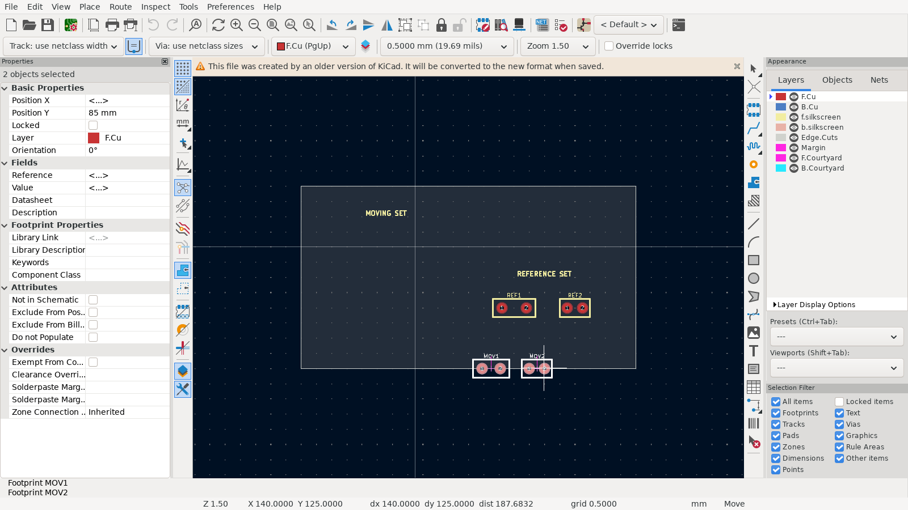

# Move Aligned To for KiCad

[](https://github.com/unguentum/kicad-axis-constrained-move/actions/workflows/native-build.yml)

Move one selection into X or Y alignment with a second selection, then continue with KiCad's native interactive movement along the axis that preserves that alignment.

## Why

KiCad 10 can align items within one selection and can constrain movement to horizontal or vertical lines. It cannot use one group as the moving set and a second group as the alignment reference, then transition directly into constrained placement.

Move Aligned To supplies that missing workflow through a small KiCad IPC extension. The repository's Nix flake builds the matching patched KiCad revision and embeds the plugin.

## Screenshots





## Workflow

1. Select the items that should move.
2. Run **Tools → External Plugins → Move Aligned To** or use its toolbar button.
3. Select one or more reference items in the PCB editor.
4. Choose:
   - **Same X**: align the combined bounding-box centres on X, then move vertically.
   - **Same Y**: align the combined bounding-box centres on Y, then move horizontally.
5. Select **Align and move**.
6. Click in KiCad to place, or press `Esc` to cancel the complete operation.

The aggregate centre is the centre of the combined geometric bounding box of each selection. Footprint reference/value text is excluded so moving text does not unexpectedly change alignment.

The initial alignment and final placement are one KiCad undo operation. Cancelling the native move also cancels the initial alignment.

## Install on NixOS

The flake produces one KiCad package containing both the native patch and the plugin. No files need to be copied into your home directory.

### Try it without installing

With flakes enabled:

```sh
nix run github:unguentum/kicad-axis-constrained-move
```

The first invocation compiles the patched KiCad revision and can take a while. Later invocations reuse the Nix store result.

In KiCad, enable **Preferences → Preferences → Plugins → Enable IPC API**, restart KiCad, and open the PCB Editor. The action appears under **Tools → External Plugins → Move Aligned To**.

### Install into your user profile

```sh
nix profile install github:unguentum/kicad-axis-constrained-move#patched-kicad
kicad
```

To update or remove it later:

```sh
nix profile upgrade kicad-axis-constrained-move
nix profile remove kicad-axis-constrained-move
```

### Add it to a NixOS flake

Add the project as an input and apply its overlay:

```nix
{
  inputs = {
    nixpkgs.url = "github:NixOS/nixpkgs/nixos-unstable";
    move-aligned.url = "github:unguentum/kicad-axis-constrained-move";
  };

  outputs = { nixpkgs, move-aligned, ... }: {
    nixosConfigurations.tablet = nixpkgs.lib.nixosSystem {
      system = "x86_64-linux"; # use aarch64-linux on an ARM tablet
      modules = [
        ({ pkgs, ... }: {
          nixpkgs.overlays = [ move-aligned.overlays.default ];
          environment.systemPackages = [ pkgs.kicad-axis-constrained-move ];
        })
      ];
    };
  };
}
```

Then rebuild as usual:

```sh
sudo nixos-rebuild switch --flake .#tablet
```

If Home Manager owns your package list, apply the same overlay through `nixpkgs.overlays` and put `pkgs.kicad-axis-constrained-move` in `home.packages` instead.

### Why this is packaged this way

nixpkgs already has declarative KiCad add-on infrastructure: `pkgs.kicad.override { addons = [ ... ]; }`. This flake uses that mechanism, packaging the plugin in KiCad's expected `share/kicad/scripting/plugins` tree and adding its Python path to the wrapped KiCad process. It applies [`patches/0001-Expose-axis-constrained-interactive-move-over-IPC.patch`](patches/0001-Expose-axis-constrained-interactive-move-over-IPC.patch) to nixpkgs's pinned KiCad source and passes that result through the supported `kicad-unstable.override { srcs = { ... }; }` interface.

There is no dependency on a KiCad source fork. The flake lock pins nixpkgs—and therefore the compatible upstream KiCad source—while the patch and plugin live together in this repository. Updating nixpkgs deliberately fails during the patch phase if upstream changes make the patch incompatible.

## Requirements

- Nix with flakes enabled, for the Nix installation above
- IPC API enabled in **Preferences → Preferences → Plugins**

KiCad creates and manages the plugin's Python environment from `requirements.txt`.

## Manual installation

Manual installation of the plugin alone is useful for development, but it still requires the patched KiCad build:

```text
~/.local/share/KiCad/10.0/plugins/com.github.unguentum.kicad-move-aligned-to/
```

Equivalent locations are `%USERPROFILE%\\Documents\\KiCad\\10.0\\plugins` on Windows and `~/Documents/KiCad/10.0/plugins` on macOS.

## Development

```sh
nix develop
pytest -q
ruff check .
```

Or run the complete reproducible check, including KiCad's official plugin-package validator:

```sh
nix run .#test
```

The test board is [`examples/alignment-demo.kicad_pcb`](examples/alignment-demo.kicad_pcb).

## Current scope

The plugin starts KiCad's native **Move** operation. KiCad 10 does not expose a corresponding track-preserving `InteractiveDragItems` command through its stable IPC API, so connected-track dragging is not yet offered.

The plugin supports footprints, pads, vias, tracks, zones, text, ordinary board graphics, and groups composed of supported items. It reports unsupported item types before placement rather than silently placing them incorrectly.

## License

MIT
