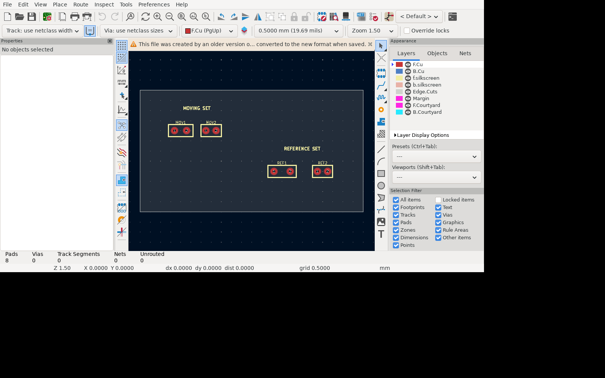

# Move Aligned To for KiCad

Move one selection into X or Y alignment with a second selection, then continue with KiCad's native interactive movement along the axis that preserves that alignment.

## Why

KiCad 10 can align items within one selection and can constrain movement to horizontal or vertical lines. It cannot use one group as the moving set and a second group as the alignment reference, then transition directly into constrained placement.

Move Aligned To supplies that missing workflow through a small KiCad IPC extension. The
repository's Nix flake builds the matching patched KiCad revision.

## Screenshots




## Workflow

1. Select the items that should move.
2. Run **Tools → External Plugins → Move Aligned To** or use its toolbar button.
3. Select one or more reference items in the PCB editor.
4. Choose:
   - **Same X**: align the combined bounding-box centres on X, then move vertically.
   - **Same Y**: align the combined bounding-box centres on Y, then move horizontally.
5. Select **Align and move**.
6. Click in KiCad to place, or press `Esc` to cancel the complete operation.

The aggregate centre is the centre of the combined geometric bounding box of each selection. Footprint reference/value text is excluded so moving text does not unexpectedly change alignment.

The initial alignment and final placement are one KiCad undo operation. Cancelling the native move also cancels the initial alignment.

## Requirements

- The patched KiCad build supplied by this repository
- IPC API enabled in **Preferences → Preferences → Plugins**
- Python 3.10 or newer with wxPython

KiCad creates and manages the plugin's Python environment from `requirements.txt`.

## Install with Nix

```sh
nix build github:unguentum/kicad-axis-constrained-move#patched-kicad
nix run github:unguentum/kicad-axis-constrained-move#install
./result/bin/kicad
```

The patched source is pinned to
[`unguentum/kicad-source-mirror@29d6480`](https://github.com/unguentum/kicad-source-mirror/commit/29d648080d9aa1085393d2bdc20c538af5c00e76).
Reload plugins in the PCB Editor after installation.

For another KiCad data-directory version:

```sh
KICAD_VERSION=10.0 nix run .#install
```

## Manual installation

Copy the repository contents to:

```text
~/.local/share/KiCad/10.0/plugins/com.github.unguentum.kicad-move-aligned-to/
```

Equivalent locations are `%USERPROFILE%\\Documents\\KiCad\\10.0\\plugins` on Windows and `~/Documents/KiCad/10.0/plugins` on macOS.

## Development

```sh
nix develop
pytest -q
ruff check .
```

Or run the complete reproducible check, including KiCad's official plugin-package validator:

```sh
nix run .#test
```

The test board is [`examples/alignment-demo.kicad_pcb`](examples/alignment-demo.kicad_pcb).

## Current scope

The plugin starts KiCad's native **Move** operation. KiCad 10 does not expose a corresponding track-preserving `InteractiveDragItems` command through its stable IPC API, so connected-track dragging is not yet offered.

The plugin supports footprints, pads, vias, tracks, zones, text, ordinary board graphics, and groups composed of supported items. It reports unsupported item types before placement rather than silently placing them incorrectly.

## License

MIT
